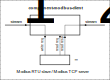
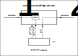
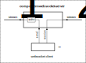
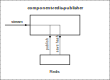
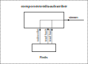
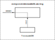
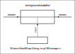
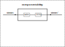

Компоненты для построения системы сбора данных

## Компоненты

### Опрос и управление устройствами

#### [rsiot-modbus-client](./rsiot-modbus-client/README.md) - Modbus client (TCP, RTU)



#### OPC UA

#### S7 (контроллеры Сименс)

#### [rsiot-http-client](./rsiot-http-client/README.md)

Отправка и получение данных на внешний HTTP API сервер

#### [rsiot-websocket-client](./rsiot-websocket-client/README.md)

Получение и отправка на внешний сервер Websocket

### Отдача данных

#### [rsiot-http-server](./rsiot-http-server/README.md)

Получение и ввод данных через HTTP API



#### [rsiot-websocket-server](./rsiot-websocket-server/README.md)

Получение и ввод данных через Websocket Server



#### MQTT

#### Modbus TCP master

#### Telegram bot - отправка сообщений

### Брокеры сообщений

#### [rsiot-redis-publisher](./rsiot-redis-publisher/README.md) - публикация сообщений в Redis



#### [rsiot-redis-subscriber](./rsiot-redis-subscriber/README.md) - получение данных из Redis



### Сохранение данных в базе

#### [rsiot-timescaledb-storing](./rsiot-timescaledb-storing/README.md) - TimescaleDB



### Построение интерфейса

#### leptos

### [Служебные компоненты](./rsiot-channel-utils/README.md)

#### component_cache

Сохранение сообщений в кеше. Входящие сообщения могут сразу пересылаться на выход.



#### component_combine

#### component_delay

Перенаправление сообщений с задержкой. Поступающие сообщения сохраняются в кеше, периодически значения из кеша пересылаются на выход.



#### component_filter

#### component_mpsc_to_broadcast

#### component_mpsc_to_many_mpsc

## Описание

Отдельные компоненты выполнены в виде асинхронных задач `tokio`. Взаимодействие через очереди сообщений `tokio::sync::mpsc`.

## Разработка

Для запуска необходимых docker-образов:

```bash
docker compose --profile dev up -d
```

## Публикация версии

Изменяем номер версии проекта:

```bash
cargo ws version patch --no-git-push
# или major, minor, patch
```

Публикуем на `crates.io`:

```bash
cargo ws publish --from-git
```
