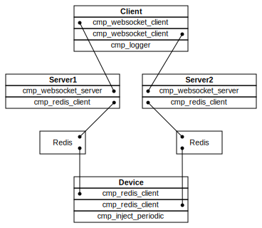

Пример резервированного подключения клиента к серверу



Запуск

```bash
zellij --layout zellij.kdl
```

Порты:

- 8010 - server1, cmp_websocket_server
- 8011 - server2, cmp_websocket_server
- 8012 - redis1
- 8013 - redis1, ui
- 8014 - redis2
- 8015 - redis2, ui
