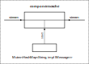
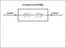

Утилиты для работы очереди сообщений

## component_cache

Сохранение сообщений в кеше. Входящие сообщения могут сразу пересылаться на выход.

## component_combine_message

Сборка нескольких сообщений в одно

## component_delay

Перенаправление сообщений с задержкой. Поступающие сообщения сохраняются в кеше, периодически значения из кеша пересылаются на выход.

Пример использования:

- источник генерирует сообщения быстрее, чем потребитель может обработать

- для одновременного обновления данных в интерфейсе пользователя

## component_filter

Фильтрация сообщений

## component_mpsc_to_broadcast

Преобразование mpsc::Receiver в broadcast::Sender

## component_mpsc_to_many_mpsc

Преобразование одного mpsc::Receiver в несколько mpsc::Sender

TODO - компонент-заглушка, который потребляет все входящие сообщения

TODO - компонент-логгер, который логгирует все приходящие сообщения и передает на выход
