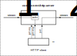

Компонент для получения данных через HTTP server.

Ссылки:

- [Документация docs.rs](https://docs.rs/rsiot-http-server/latest/)

- [Репозиторий GitHub](https://github.com/Konstantin-Dudersky/rsiot/tree/main/rsiot-http-server)

- [Примеры](https://github.com/Konstantin-Dudersky/rsiot/tree/main/rsiot-http-server/examples)

## Определение API

**GET `/messages`**

Получение коллекции всех сообщений.

**GET `/messages/<KEY>`**

Получение сообщения по ключу.

**PUT `/messages`**

Ввод сообщения. Значение передается в виде JSON в теле запроса.

## Тестирование

См. файл insomnia.json в корне
