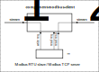

<!-- cargo-rdme start -->

Опрос устройств Modbus, используя библиотеку
[tokio-modbus](https://crates.io/crates/tokio-modbus)

Ссылки:

- [Документация docs.rs](https://docs.rs/rsiot-modbus-client/latest/)

- [Репозиторий
  GitHub](https://github.com/Konstantin-Dudersky/rsiot/tree/main/rsiot-modbus-client)

- [Примеры](https://github.com/Konstantin-Dudersky/rsiot/tree/main/rsiot-modbus-client/examples)

## Тестирование

Готовый docker-образ для тестов - [GitHub](https://github.com/cybcon/modbus-server).

Запускается через docker compose в корне. [Инструкция](../doc/development.md).

# Диаграмма



# Пример

```rust
```

TODO - рестарт не работает

<!-- cargo-rdme end -->
